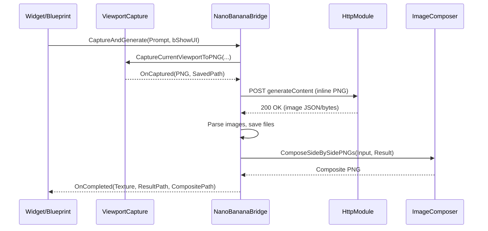

# Design Overview

This Unreal Engine plugin captures the current viewport, sends it to an image generation service ("Nano Banana", e.g., Gemini), and returns/saves results. It is organized as independent modules with clear responsibilities and minimal cross-coupling.

## Modules
- ViewportCapture (`Source/ViewportCapture`)
  - Public API: `UViewportCaptureLibrary`
    - `CaptureCurrentViewportToPNG(WorldContext, bShowUI, OutputPath, OnCaptured)`
    - `RenderTargetToPNG(RenderTarget, OutPNG, OutW, OutH)` and `SavePNGToDisk(PNG, AbsolutePath)`
  - Captures the Game Viewport via engine screenshot delegate, compresses to PNG, and optionally saves.

- ImageComposer (`Source/ImageComposer`)
  - Public API: `UImageComposerLibrary`
    - `ComposeSideBySidePNGs(LeftPNG, RightPNG, OutCompositePNG, Padding)`
  - Decodes PNG to BGRA, composites scanlines, re-encodes to PNG via `ImageWrapper`.

- NanoBananaBridge (`Source/NanoBananaBridge`)
  - Public API: `UNanoBananaBridgeAsyncAction`
    - `CaptureAndGenerate(WorldContext, Prompt, bShowUI)` and `CaptureAndGenerateAdvanced(...)`
    - Delegates: `OnProgress`, `OnCompleted(Texture, ResultPath, CompositePath)`, `OnFailed(Error)`
  - Flow: capture -> HTTP POST to `UNanoBananaSettings::ApiBaseUrl` -> parse response -> save result(s) -> optional side-by-side composition with input -> broadcast completion.
  - Parses Google Gemini `generateContent` responses (image_generation tool) and common JSON fallbacks. Supports API key in query (Google) or Bearer header (custom).

- UIProgress (`Source/UIProgress`)
  - `UNanoBananaWidgetBase` wires a minimal UMG surface (prompt textbox, progress bar, image) to the async action; exposes `StartFromViewport` and `StartWithPrompt`.

## Data Flow
1. UI or Blueprint calls `UNanoBananaBridgeAsyncAction::CaptureAndGenerate`.
2. `ViewportCapture` captures the viewport -> PNG bytes + optional disk save.
3. `NanoBananaBridge` builds a JSON request (Gemini `:generateContent` with inline PNG) and sends via `HttpModule`.
4. Response is parsed for inline image bytes -> saved to `UNanoBananaSettings::OutputDirectory` with timestamped filenames.
5. If input was saved, `ImageComposer` creates a side-by-side composite; paths returned in `OnCompleted`.

## Sequence Diagram


## Usage Examples
Blueprint (UMG):
- Create a Widget Blueprint subclassing `UNanoBananaWidgetBase`.
- Add optional `EditableTextBox` (PromptTextBox), `ProgressBar`, `Image` and bind via the same names.
- On BeginPlay (or a button), call `StartFromViewport(bShowUI=true)` or `StartWithPrompt("a cat", true)`.
- Implement `Event OnStageChanged` and `Event OnCompleted` for UX updates.
- Configure `Project Settings -> Nano Banana / Gemini Images` with `ApiBaseUrl` and `ApiKey`.

C++ (Actor/Component):
```cpp
void AMyActor::RunNanoBanana()
{
    auto* Action = UNanoBananaBridgeAsyncAction::CaptureAndGenerate(this, TEXT("A cozy living room"), true);
    Action->OnProgress.AddDynamic(this, &AMyActor::HandleProgress);
    Action->OnCompleted.AddDynamic(this, &AMyActor::HandleCompleted);
    Action->OnFailed.AddDynamic(this, &AMyActor::HandleFailed);
    Action->Activate();
}
```

## Key Types & Files
- `UViewportCaptureLibrary` — `Public/ViewportCaptureLibrary.h`, `Private/ViewportCaptureLibrary.cpp`
- `UImageComposerLibrary` — `Public/ImageComposerLibrary.h`, `Private/ImageComposerLibrary.cpp`
- `UNanoBananaBridgeAsyncAction` — `Public/NanoBananaBridgeAsyncAction.h`, `Private/NanoBananaBridgeAsyncAction.cpp`
- `UNanoBananaSettings` — `Public/NanoBananaSettings.h`
- `UNanoBananaWidgetBase` — `Public/NanoBananaWidgetBase.h`

## Configuration
- Project Settings -> Nano Banana / Gemini Images (`UNanoBananaSettings`)
  - `ApiBaseUrl`, `ApiKey`, `OutputDirectory`, `DefaultWidth/Height`, `DefaultNumImages`, `DefaultNegativePrompt`, `AdvancedRequestJSON`.
  - Gemini: use `.../models/gemini-2.5-flash:generateContent` and set `bUseGenerateContent`.

## Error Handling & Telemetry
- Emits `OnFailed` for capture errors, HTTP non-2xx, or empty results.
- Progress stages: capture -> send -> process -> compose -> completed.

## Extensibility
- Providers: add branches in `SendToService` to construct provider-specific JSON; reuse response image collection.
- Post-processing: extend `ImageComposer` for grids/overlays; add toggles via settings.
- UI: subclass `UNanoBananaWidgetBase` and implement `OnStageChanged/OnCompleted` in Blueprint.

