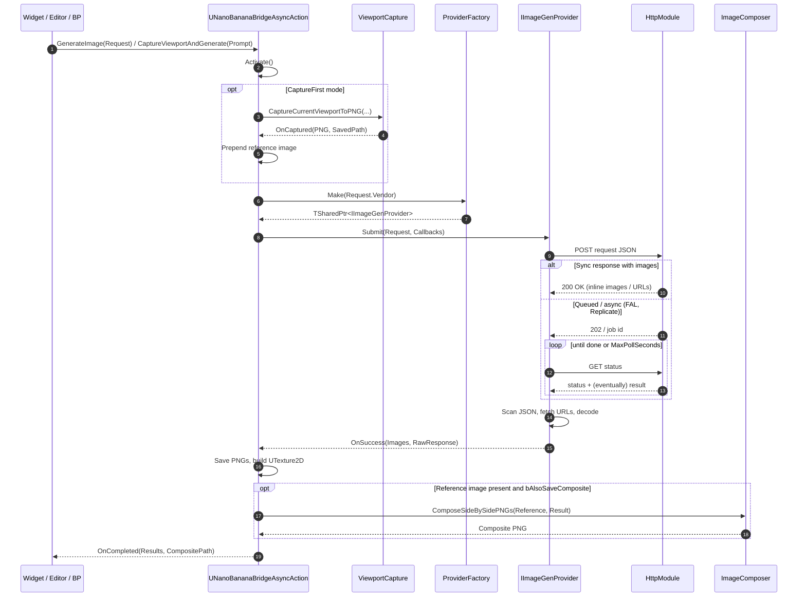

# Design Overview

This Unreal Engine plugin captures the current viewport (or any prompt) and
generates images via one of three vendors — **Google Gemini**, **FAL.ai**, or
**Replicate** — through a single vendor-agnostic Blueprint surface. The code
is split into small modules with narrow responsibilities and a provider
interface that isolates per-vendor HTTP/JSON quirks from the rest of the
plugin.

> Looking for what changed recently? See [Changelog.md](Changelog.md).
> For features under consideration, see [Roadmap.md](Roadmap.md).

## Modules

- **ViewportCapture** ([Source/ViewportCapture/](Source/ViewportCapture))
  - Public API: `UViewportCaptureLibrary`
    - `CaptureCurrentViewportToPNG(WorldContext, bShowUI, OutputPath, OnCaptured)`
    - `RenderTargetToPNG(RenderTarget, OutPNG, OutW, OutH)` and `SavePNGToDisk(PNG, AbsolutePath)`
  - Captures the Game Viewport via the engine screenshot delegate, compresses
    to PNG, and optionally saves to disk.

- **ImageComposer** ([Source/ImageComposer/](Source/ImageComposer))
  - Public API: `UImageComposerLibrary`
    - `ComposeSideBySidePNGs(LeftPNG, RightPNG, OutCompositePNG, Padding)`
  - Decodes PNG to BGRA, composites scanlines, re-encodes to PNG via
    `ImageWrapper`. Used to save an "input + result" comparison image.

- **NanoBananaBridge** ([Source/NanoBananaBridge/](Source/NanoBananaBridge))
  - Public Blueprint API: `UNanoBananaBridgeAsyncAction`
    - `GenerateImage(WorldContext, Request, bAlsoSaveComposite)` — direct,
      vendor-agnostic generation from an `FNanoBananaRequest`.
    - `CaptureViewportAndGenerate(WorldContext, Prompt, Vendor, Model, bShowUI, bAlsoSaveComposite)` —
      captures the viewport, attaches it as a reference image, then submits.
    - `Cancel()` — best-effort abort of an in-flight request.
  - Delegates: `OnProgress(Percent, Stage)`, `OnCompleted(Results, CompositePath)`,
    `OnFailed(Error)`.
  - Public types ([NanoBananaTypes.h](Source/NanoBananaBridge/Public/NanoBananaTypes.h)):
    `ENanoBananaVendor`, `ENanoBananaModel`, `ENanoBananaAspect`,
    `ENanoBananaResolution`, `ENanoBananaOutputFormat`, `FNanoBananaRequest`,
    `FNanoBananaReferenceImage`, `FNanoBananaImageResult`.
  - Internal: `IImageGenProvider` + `FProviderFactory` dispatch to one of three
    provider implementations under
    [Private/Providers/](Source/NanoBananaBridge/Private/Providers).

- **UIProgress** ([Source/UIProgress/](Source/UIProgress))
  - `UNanoBananaWidgetBase` — abstract `UUserWidget` that auto-binds optional
    widgets (`PromptTextBox`, `ProgressBar`, `ResultImage`, `VendorCombo`,
    `ModelCombo`, `CancelButton`) and exposes `StartFromViewport`,
    `StartWithPrompt`, `CancelGeneration`, plus
    `OnStageChanged`/`OnCompleted`/`OnFailed` BlueprintImplementableEvents.

- **UnrealBananaEditor** ([Source/UnrealBananaEditor/](Source/UnrealBananaEditor))
  - Editor-only module that adds **Tools → Generate from Viewport (Nano Banana)**
    and opens `SGenerateFromViewportWindow`, a Slate window with prompt input
    and vendor/model dropdowns that drives the same async action.

## Provider architecture

`UNanoBananaBridgeAsyncAction` is intentionally vendor-blind. All HTTP and
JSON shape lives behind a single interface:

```cpp
class IImageGenProvider : public TSharedFromThis<IImageGenProvider, ESPMode::ThreadSafe>
{
public:
    virtual void Submit(const FNanoBananaRequest&, const FProviderCallbacks&) = 0;
    virtual void Cancel() = 0;
};
```

`FProviderCallbacks` carries `OnProgress`, `OnSuccess(Images, RawResponse)`,
`OnFailure(Error)`, and an optional `OnRequestBuilt(RequestJson)` hook used
for debug dumps. Each `Submit()` call must invoke exactly one of
`OnSuccess`/`OnFailure`. Providers are constructed per request via
`FProviderFactory::Make(Vendor)` and held by `TSharedPtr`; in-flight HTTP
callbacks capture `TWeakPtr<This>` so a `Cancel()` or async-action teardown
cannot dangle.

Current providers ([Private/Providers/](Source/NanoBananaBridge/Private/Providers)):

| Vendor | Class | Endpoint(s) | Async model |
|---|---|---|---|
| **Google Gemini**  | `FGoogleGeminiProvider` | `:generateContent` on `generativelanguage.googleapis.com/v1beta` | Synchronous response |
| **FAL.ai**         | `FFalAiProvider`        | `fal.run` (sync) or `queue.fal.run` (queue + poll) | Sync first, falls back to queued poll |
| **Replicate**      | `FReplicateProvider`    | `api.replicate.com/v1/predictions` (with optional `Prefer: wait`) | Sync-wait first, falls back to predictions polling |

Shared HTTP utilities live under
[Private/Http/](Source/NanoBananaBridge/Private/Http): `Base64Image` (PNG
encode helpers), `JsonResponseScanner` (recursive walk that finds inline base64
images and image URLs in arbitrary JSON shapes), and `PollLoop` (cancellable
ticker-driven poller used by FAL and Replicate).

To add a new vendor:
1. Add it to `ENanoBananaVendor` in
   [NanoBananaTypes.h](Source/NanoBananaBridge/Public/NanoBananaTypes.h).
2. Implement `IImageGenProvider` under
   [Private/Providers/<Name>/](Source/NanoBananaBridge/Private/Providers).
3. Wire it into [ProviderFactory.cpp](Source/NanoBananaBridge/Private/Providers/ProviderFactory.cpp).
4. Add per-vendor config (key + URL overrides) to `UNanoBananaSettings`.
5. Add a request-builder unit test under
   [Private/Tests/Providers/](Source/NanoBananaBridge/Private/Tests/Providers).

## Data flow

1. UI / Blueprint / editor window builds an `FNanoBananaRequest` (vendor,
   model, prompt, reference images, resolution, etc.) and invokes either
   `GenerateImage` or `CaptureViewportAndGenerate`.
2. If `CaptureViewportAndGenerate`: `ViewportCapture` writes the current
   viewport to PNG and prepends it as a reference image.
3. `FProviderFactory::Make(Vendor)` returns a fresh provider; the async
   action calls `Submit(Request, Callbacks)`.
4. The provider serializes the request JSON, fires `OnRequestBuilt` (used
   for `bSaveDebugRequestResponse` dumps), and POSTs via `HttpModule`.
5. For FAL/Replicate, if the sync attempt times out or returns a job id,
   `PollLoop` polls the queue/prediction endpoint until the response
   contains image bytes/URLs or `MaxPollSeconds` elapses.
6. `JsonResponseScanner` extracts inline base64 PNGs and image URLs from the
   response; URLs are downloaded sequentially.
7. Decoded PNG byte buffers are returned via `OnSuccess`. The async action
   saves each image under `UNanoBananaSettings::OutputDirectory` with a
   timestamped filename, builds `UTexture2D` previews, and — if a reference
   image exists and `bAlsoSaveComposite` is true — calls `ImageComposer` to
   write a side-by-side comparison PNG.
8. `OnCompleted(Results, CompositePath)` fires with all
   `FNanoBananaImageResult` entries (`Texture`, `PngBytes`, `SavedPath`).

## Sequence diagram


```mermaid
sequenceDiagram
    autonumber
    participant UI as Widget / Editor / BP
    participant AA as UNanoBananaBridgeAsyncAction
    participant VC as ViewportCapture
    participant PF as ProviderFactory
    participant Prov as IImageGenProvider
    participant HTTP as HttpModule
    participant IC as ImageComposer

    UI->>AA: GenerateImage(Request) / CaptureViewportAndGenerate(Prompt)
    AA->>AA: Activate()
    opt CaptureFirst mode
        AA->>VC: CaptureCurrentViewportToPNG(...)
        VC-->>AA: OnCaptured(PNG, SavedPath)
        AA->>AA: Prepend reference image
    end
    AA->>PF: Make(Request.Vendor)
    PF-->>AA: TSharedPtr<IImageGenProvider>
    AA->>Prov: Submit(Request, Callbacks)
    Prov->>HTTP: POST request JSON
    alt Sync response with images
        HTTP-->>Prov: 200 OK (inline images / URLs)
    else Queued / async (FAL, Replicate)
        HTTP-->>Prov: 202 / job id
        loop until done or MaxPollSeconds
            Prov->>HTTP: GET status
            HTTP-->>Prov: status + (eventually) result
        end
    end
    Prov->>Prov: Scan JSON, fetch URLs, decode
    Prov-->>AA: OnSuccess(Images, RawResponse)
    AA->>AA: Save PNGs, build UTexture2D
    opt Reference image present and bAlsoSaveComposite
        AA->>IC: ComposeSideBySidePNGs(Reference, Result)
        IC-->>AA: Composite PNG
    end
    AA-->>UI: OnCompleted(Results, CompositePath)
```

## Configuration

`UNanoBananaSettings` (Project Settings → Plugins → **Nano Banana / Gemini Images**)
holds defaults plus per-vendor configuration:

- **Defaults** — `DefaultVendor`, `DefaultModel`, `DefaultAspect`,
  `DefaultResolution`, `DefaultOutputFormat`, `DefaultNumImages`,
  `DefaultNegativePrompt`.
- **Vendors → Google** — `ApiKey`, `BaseUrlOverride`. Env-var fallback when
  blank: `GEMINI_API_KEY`, then `GOOGLE_API_KEY`.
- **Vendors → FAL** — `ApiKey`, `bAlwaysUseQueue`, `SyncBaseUrlOverride`,
  `QueueBaseUrlOverride`. Env-var fallback: `FAL_KEY`.
- **Vendors → Replicate** — `ApiKey`, `bPreferSyncWait`,
  `NanoBananaVersionHash`, `NanoBananaProVersionHash`, `BaseUrlOverride`.
  Env-var fallback: `REPLICATE_API_TOKEN`.
- **Output** — `OutputDirectory` (default `Saved/NanoBanana`),
  `bSaveDebugRequestResponse`.
- **Behavior** — `RequestTimeoutSeconds`, `MaxPollSeconds`.

`GetEffectiveApiKey(Vendor)` returns the configured key or its env-var
fallback; this is the only place providers read credentials from.

## Usage examples

### Blueprint (UMG)
- Create a Widget Blueprint subclassing `NanoBananaWidgetBase`.
- Add any subset of `PromptTextBox`, `ProgressBar`, `ResultImage`,
  `VendorCombo`, `ModelCombo`, `CancelButton` — bindings are optional.
- Call `StartFromViewport(true)` or `StartWithPrompt("a cozy living room", true)`
  from a button or `BeginPlay`.
- Implement `OnStageChanged`, `OnCompleted`, `OnFailed` for UX feedback.

### C++
```cpp
void AMyActor::RunNanoBanana()
{
    FNanoBananaRequest Req;
    Req.Prompt   = TEXT("A cozy living room, evening light");
    Req.Vendor   = ENanoBananaVendor::Fal;
    Req.Model    = ENanoBananaModel::NanoBanana2;
    Req.Aspect   = ENanoBananaAspect::R16x9;
    Req.NumImages = 1;

    auto* Action = UNanoBananaBridgeAsyncAction::GenerateImage(this, Req, /*bAlsoSaveComposite*/ false);
    Action->OnProgress.AddDynamic(this, &AMyActor::HandleProgress);
    Action->OnCompleted.AddDynamic(this, &AMyActor::HandleCompleted);
    Action->OnFailed.AddDynamic(this, &AMyActor::HandleFailed);
    Action->Activate();
}
```

### Editor
**Tools → Generate from Viewport (Nano Banana)** opens a Slate window with
prompt input and vendor/model dropdowns; results land in
`OutputDirectory` and a notification links to the saved file.

## Error handling & telemetry

- `OnFailed(Error)` fires for capture failures, missing API keys, HTTP
  non-2xx responses, empty/malformed result payloads, poll timeouts, and
  user-initiated cancellation (`"Canceled"`).
- Progress stages emitted via `OnProgress(Percent, Stage)` follow the rough
  pipeline: `capture` → `submit` → `poll` (when applicable) → `download` →
  `compose` → `completed`.
- When `bSaveDebugRequestResponse` is enabled, both the outgoing request
  body and the raw response are written to `OutputDirectory/Debug/` with
  timestamped filenames.

## Key files

- [UViewportCaptureLibrary](Source/ViewportCapture/Public/ViewportCaptureLibrary.h) — viewport → PNG.
- [UImageComposerLibrary](Source/ImageComposer/Public/ImageComposerLibrary.h) — side-by-side composite.
- [UNanoBananaBridgeAsyncAction](Source/NanoBananaBridge/Public/NanoBananaBridgeAsyncAction.h) — public async action.
- [NanoBananaTypes.h](Source/NanoBananaBridge/Public/NanoBananaTypes.h) — request / result / enum types.
- [UNanoBananaSettings](Source/NanoBananaBridge/Public/NanoBananaSettings.h) — project settings.
- [IImageGenProvider](Source/NanoBananaBridge/Private/Providers/IImageGenProvider.h) — provider interface.
- [FProviderFactory](Source/NanoBananaBridge/Private/Providers/ProviderFactory.h) — provider dispatch.
- [UNanoBananaWidgetBase](Source/UIProgress/Public/NanoBananaWidgetBase.h) — UMG base.
- [UnrealBananaEditorModule.cpp](Source/UnrealBananaEditor/Private/UnrealBananaEditorModule.cpp) — Tools menu entry.
